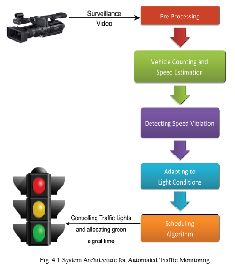
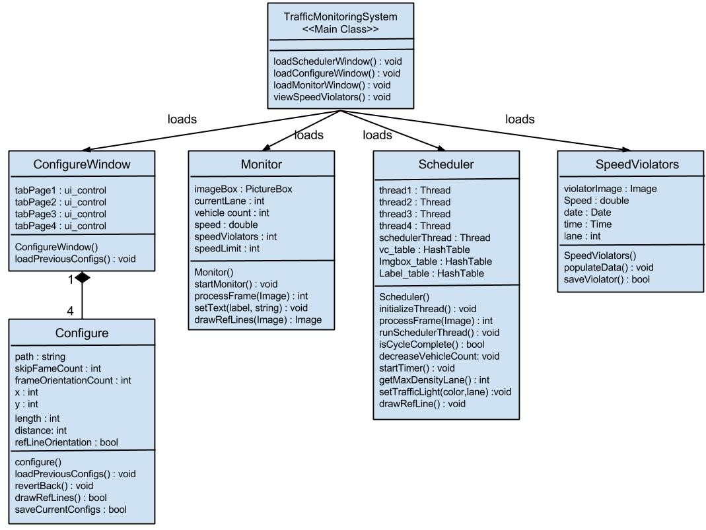
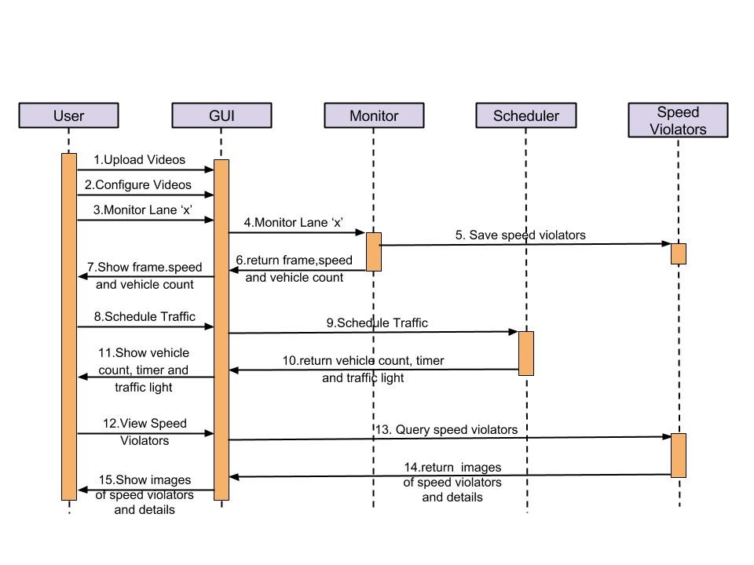

# Automated-Traffic-Monitoring-System
An application which automates traffic controlling by counting vehicles, speed violators and allocating green signal time fairly to each lane using priority based yet cyclic scheduling algorithm.

## Introduction  
We  have  the  ever  increasing problem of traffic violation. Decreasing  the  number  of  violations brings  more order and decreases the number of accidents. Currently the monitoring  is done  manually  in  majority of the cases. In some other cases radar guns are used. But these guns cannot target short-range and multiple vehicles. Hence  we can  use computer vision  technology  to  aid humans to prevent these violations.Detecting vehicles in surveillance data is one of the most sought after problems in computer vision. Here we have made an attempt to count vehicles ,detect speed violation and schedule traffic based on the dynamically changing density of vehicle counts along all lanes in the traffic junction.

## Objective
- Identifying vehicles entering a region of interest.
- Estimation of the speeds of vehicles entering a region of interest
- Speed violation detection of vehicles crossing the region of interest.
- To minimize the traffic congestion and traffic delay by scheduling traffic lights based on density of traffic in a traffic junction.

## High Level Design  

## Sub-systems  

1. **Pre-Processing**  
Each video should be configured to draw two reference lines for each lane. The RGB values of the pixels forming reference lines have to be stored for the first frame

2. **Vehicle Counting and Speed Estimation**  
When a vehicle passes through either one of the reference lines, colour of the pixels forming reference lines changes with respect to that in the first frame. Based on the pattern of this  change, vehicle count is determined. Frame count at which vehicle exits first and second reference line and distance between two reference lines help in estimating speed.

3. **Detecting Speed Violation**  
Vehicles crossing the given speed limit are identified and image of those vehicles are cropped out and saved in the system.

4. **Adapting to Lighting Conditions**  
As the lighting conditions vary with time throughout the   day the system has to  notice small changes to the pixel  RGB values and move from initial RGB values to the new  RGB values, making the system consistent with gradual  changes in lighting conditions

5. **Scheduling Algorithm**  
The vehicle count in each lane is taken as the density of the lane. A Priority based Cyclic Scheduling algorithm is run on these values. This determines which lane should be allowed first and how much green signal time should be allocated for each lane.

## Class Diagram  

## Sequence Diagram  

## Demo  

## Publications
1. **Automated Traffic Monitoring System using Computer Vision**
- Provides a method to count number of vehicles in a surveillance video and an algorithm to estimate speed. 
- April 6, 2017, IEEE ICT in Business Industry & Government
- ISSN: 978-1-5090-5515-9
-	[IEEE Research Paper] (https://ieeexplore.ieee.org/document/7892717)

2. **Density Based Dynamic Traffic Scheduling System**
- Provides an efficient scheduling algorithm to solve traffic congestion.
- June 2017,  International Journal of Computer Sciences and Engineering
- ISSN: 0975–3397 VOLUME 9 ISSUE 06 2017
- [IJCSE Research Paper] (http://www.enggjournals.com/ijcse/doc/IJCSE17-09-06-001.pdf)

